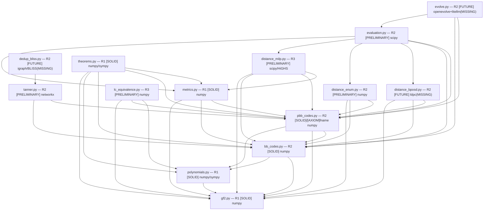

# file_dependency_plan.md — Module Logical Dependency Plan for arXiv:2606.02418

Paper: "Evolutionary Discovery of Bivariate Bicycle Codes with LLM-Guided Search"
(Cruz-Benito, Cross, Kremer, Faro; IBM Research; PRX Quantum).
Source tex: `ref-paper/arxiv-2606.02418/src/paper.tex` (1091 lines),
`.../supplemental.tex` (715 lines).

This file maps the paper's described pipeline (Secs. III–VI + App. C/D/E + SM §"MILP
formulation details") onto a Python codebase rooted at `src/qcode_discovery/`, and
gives the module import-dependency DAG. Each module is a TYPED entry per the Accepted
Object Schema of `_common/agentic_lean_contract.md`:
`id · purpose · paper anchor · imports (intra-pkg) · external deps · risk tier · status`.

Status vocabulary (`markers.md`): `[SOLID] [PRELIMINARY] [HYPOTHESIS]` + gap markers
`[AXIOM] [HOLE] [FUTURE] [BLOCKING]`. Risk tiers per `code_quality_policy.md` (R0–R4).
Tex labels (`thm:ab_d2`, `lem:crt_k`, `eq:milp_obj`, `eq:milp_commute`,
`eq:milp_anticommute`, `eq:milp_binary`, `app:ab_trap`, `app:crt`, `app:lc`) preserved VERBATIM.

> **PROVENANCE WARNING [BLOCKING].** The reference repository
> `github.com/qiskit-community/qcode-discovery` (cited `cruzbenito2026qcode`,
> paper.tex l.386) is **EMPTY — README only — as of 2026-06-02 sha 4a9520e**
> (orchestrator-verified). This module/file-dependency graph is therefore derived
> **from the PAPER's described pipeline, NOT from the authors' source tree.** It is a
> *proposed* layout (`[HYPOTHESIS]` at the architecture level), not a faithful import
> of an existing one. The only filenames the paper itself names are
> `evaluation/clifford_equivalence.py` (paper.tex l.1087) and `evaluation/pbb_code.py`
> (supplemental.tex l.690); these are referenced, not reproduced ⇒ `[AXIOM]`. Unblocks
> only when upstream populates the repo; owner = upstream authors.

---

## Pipeline → module crosswalk

The paper's pipeline (Fig.~1 `fig:pipeline`, paper.tex l.231-241) is:

```
LLM diff → ansatz G(l,m) → {(A,B)} or {(A,B,C,D)}     [evolve.py — FUTURE]
   │
   ├─ Stage 1 (~2s): k-only F2 rank on (6,6),(12,6)    [evaluation.py → metrics.py → gf2.py]
   ├─ Stage 2 (~30–60s): BP-OSD distance on 8 lattices [evaluation.py → distance_bposd.py — FUTURE]
   └─ Stage 3 (MILP exact; in-loop C4-5, post-hoc C1-3)[evaluation.py → distance_milp.py]
   │
   └─ MAP-Elites archive  ──feedback──> LLM            [evolve.py — FUTURE]

Post-campaign (paper.tex l.239):
   MILP distance → BLISS dedup → Tanner decomposability → LC equivalence (PBB)
   [distance_milp.py] [dedup_bliss.py — FUTURE] [tanner.py] [lc_equivalence.py]
```

The construction substrate (`gf2.py` → `polynomials.py` → `bb_codes.py` / `pbb_codes.py`)
underlies every stage. `theorems.py` provides numeric witnesses for `thm:ab_d2` / `lem:crt_k`
and is a test/validation leaf, not on the runtime path.

---

## Module typed entries

Layered bottom→top. "Imports" = intra-package only. "Ext" = third-party (✓ = available
in LOCAL ENV: numpy 1.26.4, scipy 1.17.1, sympy 1.12; ✗ = MISSING locally).

### L0 — Algebra substrate

| id | module | purpose | paper anchor | imports | ext | tier | status |
|----|--------|---------|--------------|---------|-----|------|--------|
| mod.gf2 | `gf2.py` | F2 linear algebra: row-reduction, `rank`, `nullspace`/kernel basis, solve `Hx=b`, orthogonal complement. The single primitive under k-computation (Stage 1), the MILP mod-2 linearization, the achievable-syndrome GF(2) projection (paper.tex l.358), and the LC affine GF(2) system (paper.tex l.1064). | paper.tex l.167 (`rank_F2(H_X)`), l.247 (Stage-1 F2 rank), l.358, l.1036, l.1064 | — | numpy ✓ | R1 | [SOLID] (pure F2 linear algebra; deterministic; unit-testable in isolation) |
| mod.poly | `polynomials.py` | Ring `R = F2[x,y]/(x^l-1, y^m-1)`: monomial/coeff representation, ring add/mul, the involution `A^T` (`x→x^-1, y→y^-1`, paper.tex l.164), and `to_circulant(p) → (l*m)×(l*m)` matrix. Also univariate cyclic `gcd(f, z^N-1)` for `lem:crt_k` witnesses. | paper.tex l.158, l.164; supplemental.tex l.1015 (`dim ker H = deg gcd`) | mod.gf2 (kernel-dim helper only) | numpy ✓; sympy ✓ (cyclotomic gcd) | R1 | [SOLID] (closed-form circulant; commutativity of R is the CSS-condition root) |

### L1 — Code constructions

| id | module | purpose | paper anchor | imports | ext | tier | status |
|----|--------|---------|--------------|---------|-----|------|--------|
| mod.bb | `bb_codes.py` | BB CSS code from trinomial (C1-3) or 4–6-term (C4) pair `(A,B)`: `H_X=(A\|B)`, `H_Z=(B^T\|A^T)`; assert CSS condition `AB+BA=0` over F2; expose `H_X, H_Z, n=2lm`. | paper.tex l.160-167 (`H_X,H_Z`), l.166 (`AB+BA=0`), l.168 (C4 4–6 term) | mod.poly, mod.gf2 | numpy ✓ | R2 | [SOLID] |
| mod.pbb | `pbb_codes.py` | PBB non-CSS code from 4-tuple `(A,B,C,D)`: `H=[[A,B,C,D],[0,0,B^T,A^T]]`; commutativity test `(A C^T + B D^T)` symmetric over F2 (the only nontrivial condition, paper.tex l.180); reduces to BB when `C=D=0`. Paper names this `evaluation/pbb_code.py` (supplemental.tex l.690). | paper.tex l.174-183 (`H`, commute cond); supplemental.tex l.690 | mod.poly, mod.gf2, mod.bb (C=D=0 fallthrough) | numpy ✓ | R2 | [SOLID] (construction); [AXIOM] on the upstream filename `evaluation/pbb_code.py` |

### L2 — Metrics & distance

| id | module | purpose | paper anchor | imports | ext | tier | status |
|----|--------|---------|--------------|---------|-----|------|--------|
| mod.metrics | `metrics.py` | `k = 2lm - 2·rank_F2(H_X)` (Stage-1 k-only screen); `FOM = k·d^2/n`; `d/sqrt(n)` trust statistic (≤1.3 trusted, ≥2.0 discarded, linear interp). Cheap, deterministic. | paper.tex l.167 (k), l.200-202 (FOM), l.369 (trust filter) | mod.gf2, mod.bb, mod.pbb | numpy ✓ | R1 | [SOLID] |
| mod.dist_milp | `distance_milp.py` | Exact/UB distance via MILP (HiGHS / `scipy.optimize.milp`). CSS: min `Σx_i` s.t. `H_Z x≡0`, `⟨x,Zbar_j⟩≡1`, `x∈{0,1}`; mod-2 linearized by integer slack `Σa_i x_i - 2s = b` (`eq:milp_obj`–`eq:milp_binary`). Symplectic non-CSS: min `Σw_i`, `w_i = a_i OR b_i` (`w_i≥a_i, w_i≥b_i, w_i≤a_i+b_i`), `H(a\|b)^T≡0`, symplectic anticommute with `Lbar_j`, row-flip `(s_Z\|s_X)`, 3n binary vars (~4× slower). `d=min(d_X,d_Z)`; exact iff MIP gap=0 else valid UB. | paper.tex l.319-336 (`sec:milp`); supplemental.tex l.659-691 (`sm:milp`, `eq:*`) | mod.gf2, mod.bb, mod.pbb, mod.metrics | scipy ✓ (HiGHS) | R3 | [PRELIMINARY] (R3: load-bearing exact-distance certificate; needs gap=0 audit + validation on [[72,12,6]],[[144,12,12]] per supplemental.tex l.695). `Lbar_j` for non-CSS comes from qldpc symplectic Gaussian elimination ⇒ [AXIOM]/[HOLE] on that input (see mod.evolve note) |
| mod.dist_enum | `distance_enum.py` | Tier-1 exhaustive weight-`w` enumeration: syndrome→operator lookup dict + XOR; finds `d=w` exactly if a weight-`w` nontrivial logical exists. Bounded `d≤6` at `n≤216`, `d≤4` at `n>216` (~89 GB at n=360). | paper.tex l.344-347 (Tier 1) | mod.gf2, mod.bb, mod.pbb | numpy ✓ | R2 | [PRELIMINARY] (memory-bounded; correctness simple but the n-cap is a hard [FUTURE] limit) |
| mod.dist_bposd | `distance_bposd.py` | Stage-2 in-loop distance estimate + post-hoc Tier-3 stochastic UPPER bounds. Multi-decoder protocol (OSD0/sp, OSD-CS10/sp, OSD-CS10/ms; 150k trials). Non-CSS: achievable-syndrome sampling (sample only the per-channel achievable subspace = GF(2) null-space projection on channel-restricted stabilizer matrix). **Overestimates up to 12× for k/n>0.1.** | paper.tex l.306-317 (`sec:bposd_limits`), l.353-360 (Tier 3, achievable-syndrome) | mod.gf2, mod.bb, mod.pbb (achievable-subspace projection uses mod.gf2) | `ldpc` v2.2.0 ✗ MISSING | R2 | [FUTURE] (needs `ldpc`; ⇒ [AXIOM] on the decoder. Provides only UB — MUST NOT be promoted to exact; the paper's central methodological finding is precisely that this overestimates) |

### L3 — Equivalence & structure (post-campaign)

| id | module | purpose | paper anchor | imports | ext | tier | status |
|----|--------|---------|--------------|---------|-----|------|--------|
| mod.tanner | `tanner.py` | Colored Tanner graph builder + decomposability. CSS coloring: qubits c0, X-checks c1, Z-checks c2. Non-CSS: per-stabilizer X-support & Z-support vertices + tying edge (3 colors). Decomposability = connectivity of `(H_X+H_Z)` Tanner graph; disconnected ⇒ direct sum (e.g. `[[288,24,12]] = [[144,12,12]]+[[144,12,12]]`). | paper.tex l.381-388 (coloring), l.100 (decomposable [[288,24,12]]); l.239 | mod.bb, mod.pbb | networkx (fallback) ✓ if used; numpy ✓ | R2 | [PRELIMINARY] (graph build is deterministic; decomposability via connected-components is a [SOLID] sub-claim) |
| mod.dedup | `dedup_bliss.py` | Permutation-equivalence dedup via BLISS canonical form of the colored Tanner graph. 225 CSS reps → 97 distinct; 720 PBB → 368. Two graphs equal canonical form ⇔ permutation-equivalent. | paper.tex l.380-393 (`sec:families` dedup), l.96 (BLISS) | mod.tanner | `python-igraph`+BLISS ✗ MISSING (networkx VF2 fallback ✓, exponential worst-case) | R2 | [FUTURE] (needs igraph/BLISS for the exact counts; networkx fallback is correctness-equivalent but not scale-equivalent ⇒ counts 97/368 are [AXIOM] until reproduced) |
| mod.lc | `lc_equivalence.py` | LC-CSS equivalence for PBB (`app:lc`). Group-CSS rank test: CSS iff `rank[X\|Z]=rankX+rankZ` (Lemma 7.4 `cross2025small`). 6 coset reps `{I,S,H,HS,SH,HSH}`. Hadamard 2-coloring (parity union-find; bipartite ⇔ Hadamard-CSS at generator level). Affine GF(2) systems for non-uniform `{I,S}`/`{H,HS}`; 36 uniform per-block. Result: 11/368 CSS-equiv (10 Hadamard, 1 uniform-S `[[36,4,6]]`); 357 CSS-inequiv within tested families. Paper names this `evaluation/clifford_equivalence.py` (paper.tex l.1087). | paper.tex l.1026-1087 (`app:lc`), l.189-194 (`sec:pbb` 3 checks) | mod.gf2, mod.pbb, mod.poly | numpy ✓ | R3 | [PRELIMINARY] (R3: equivalence claim; Lemma 7.4 ⇒ [AXIOM] on `cross2025small`; residual coverage gaps (a)–(b) at paper.tex l.1070-1075 are explicit [HOLE]s — 357 count is conditional, "within tested LC families"). Upstream filename ⇒ [AXIOM] |

### L4 — Orchestration

| id | module | purpose | paper anchor | imports | ext | tier | status |
|----|--------|---------|--------------|---------|-----|------|--------|
| mod.eval | `evaluation.py` | Staged cascade orchestrator. Stage 1 (k-only, ~2s, (6,6)+(12,6)); Stage 2 (BP-OSD distance, 8 lattices `{(12,6),(6,12),(12,12),(24,6),(15,12),(30,6),(16,9),(18,8)}`, top-10 by k-diversity, FOM≥6 → extra batches); Stage 3 (MILP exact: in-loop C4-5, post-hoc C1-3). Trust filter on `d/sqrt(n)`. Emits per-candidate fitness for the archive. | paper.tex l.243-258 (`sec:cascade`), l.249 (8 lattices), l.366-371 (`sec:trust`) | mod.metrics, mod.dist_milp, mod.dist_enum, mod.dist_bposd, mod.bb, mod.pbb | scipy ✓; ldpc ✗ (Stage 2 degrades to MILP/enum only without it) | R2 | [PRELIMINARY] (cascade wiring is straightforward; Stage 2 fidelity blocked on `ldpc`) |
| mod.evolve | `evolve.py` | MAP-Elites LLM-guided program synthesis. Evolve ansatz `G(l,m)→{(A_i,B_i)}` / 4-tuples. MAP-Elites dims: (#lattices with k≥8 codes, total such codes); C4 uses term-count/monomial-structure dims. 4–6 islands, migration 12–25 iters. LLM proposes diffs; archive feeds back. | paper.tex l.217-229 (`sec:framework`), l.220 (OpenEvolve), l.226 (dims) | mod.eval, mod.bb, mod.pbb | `openevolve` ✗, `litellm` ✗ MISSING | R2 | [FUTURE] (needs openevolve+litellm; the evolutionary loop is the non-reproducible-locally layer ⇒ [AXIOM] on the LLM/MAP-Elites engine. The *ansätze produced* — incl. `Lbar_j` logical reps the MILP consumes — depend on this; that input is a [HOLE] for downstream verification when run standalone) |

### LX — Validation leaf (off runtime path)

| id | module | purpose | paper anchor | imports | ext | tier | status |
|----|--------|---------|--------------|---------|-----|------|--------|
| mod.thm | `theorems.py` | Numeric witnesses (NOT proofs). `thm:ab_d2` (`app:ab_trap`): for `A=B`, `k>0` build explicit weight-2 `v_i=(e_i,e_i)∈ker(H_Z)` outside rowspace(A) ⇒ exhibit `d=2`; assert column-weight≥2 ⇒ `d≥2`. `lem:crt_k` (`app:crt`): for `A=1+y+y^2`, `B=A(x^c)`, `c=l/3`, `3\|l`, `3\|m` verify `k=8l/3` via rank (paper: checked 1680 combos `lm≤250`). | paper.tex l.957-980 (`thm:ab_d2`), l.982-1024 (`lem:crt_k`) | mod.gf2, mod.poly, mod.bb, mod.pbb, mod.metrics | numpy ✓; sympy ✓ | R1 | [SOLID] (witness generation is deterministic; the *proofs* are ExactProof in the paper and live in `core.md`/`derivation.md`, NOT here. This module only re-checks numerically) |

---

## Import-dependency DAG (mermaid)



DAG is acyclic (verify: every edge points to a strictly lower layer except the
`pbb→bb` and `dedup→tanner` same/lower intra-layer edges, both acyclic; `evolve→eval`
is the single top edge). No module imports `evolve`.

---

## Machine-readable edge list

Format: `importer -> imported` (intra-package import edges only).

```
polynomials -> gf2
bb_codes -> polynomials
bb_codes -> gf2
pbb_codes -> polynomials
pbb_codes -> gf2
pbb_codes -> bb_codes
metrics -> gf2
metrics -> bb_codes
metrics -> pbb_codes
distance_milp -> gf2
distance_milp -> bb_codes
distance_milp -> pbb_codes
distance_milp -> metrics
distance_enum -> gf2
distance_enum -> bb_codes
distance_enum -> pbb_codes
distance_bposd -> gf2
distance_bposd -> bb_codes
distance_bposd -> pbb_codes
tanner -> bb_codes
tanner -> pbb_codes
dedup_bliss -> tanner
lc_equivalence -> gf2
lc_equivalence -> pbb_codes
lc_equivalence -> polynomials
evaluation -> metrics
evaluation -> distance_milp
evaluation -> distance_enum
evaluation -> distance_bposd
evaluation -> bb_codes
evaluation -> pbb_codes
evolve -> evaluation
evolve -> bb_codes
evolve -> pbb_codes
theorems -> gf2
theorems -> polynomials
theorems -> bb_codes
theorems -> pbb_codes
theorems -> metrics
```

---

## External-dependency ledger

| ext dep | used by | local? | consequence if MISSING |
|---------|---------|--------|------------------------|
| numpy 1.26.4 | gf2, poly, bb, pbb, metrics, enum, tanner, lc, thm | ✓ | — |
| scipy 1.17.1 (`scipy.optimize.milp` = HiGHS) | distance_milp, evaluation | ✓ | — (MILP is the exact-distance backbone and is runnable locally) |
| sympy 1.12 | polynomials (cyclotomic gcd), theorems | ✓ | — |
| `qldpc` v1.0.1 | (logical-operator reps `Zbar_j`/`Lbar_j` consumed by distance_milp) | ✗ MISSING | distance_milp non-CSS anticommutation needs `Lbar_j` from qldpc symplectic Gaussian elimination ⇒ [HOLE]: provide reps another way or import qldpc |
| `ldpc` v2.2.0 | distance_bposd | ✗ MISSING | Stage-2 BP-OSD unavailable; cascade degrades to MILP/enum. `[FUTURE]` |
| `python-igraph`+BLISS | dedup_bliss | ✗ MISSING | exact canonical-form dedup unavailable; networkx VF2 fallback (correct, not scalable). 97/368 counts `[AXIOM]` until reproduced |
| `openevolve` | evolve | ✗ MISSING | MAP-Elites engine unavailable. `[FUTURE]` |
| `litellm` | evolve | ✗ MISSING | LLM proxy unavailable. `[FUTURE]` |

---

## Risk-tier & build-order summary

- **Buildable & verifiable locally now (R1–R2, [SOLID]/[PRELIMINARY]):** `gf2`, `polynomials`,
  `bb_codes`, `pbb_codes`, `metrics`, `distance_enum`, `tanner`, `theorems`. These cover
  construction + k + FOM + small-distance enumeration + the two theorem witnesses + decomposability.
- **R3, load-bearing, buildable locally (scipy present):** `distance_milp` (exact-distance
  certificate — the paper's ground truth), `lc_equivalence` (CSS-equivalence — conditional on
  Lemma 7.4 [AXIOM] and explicit coverage [HOLE]s). Both demand the R3 review depth in
  `code_quality_policy.md` (independent multi-agent + validation on the paper's named baselines).
- **Blocked on MISSING externals ([FUTURE]):** `distance_bposd` (`ldpc`), `dedup_bliss`
  (`igraph`/BLISS), `evolve` (`openevolve`+`litellm`).
- **Cross-cutting [HOLE]:** non-CSS logical-operator reps (`Lbar_j`) consumed by `distance_milp`
  / `lc_equivalence` originate in `qldpc` symplectic Gaussian elimination (supplemental.tex l.679);
  standalone runs must supply these reps independently.

> **DISCIPLINE.** BP-OSD outputs are stochastic UPPER bounds only and MUST NOT be promoted to
> exact distances (the paper's headline finding: up to 12× overestimation for k/n>0.1, and the
> `A=B` `thm:ab_d2` trap that 1.5×10⁶ trials miss). The dedup counts (97 CSS / 368 PBB) and the
> LC result (11 CSS-equiv / 357 CSS-inequiv) remain `[AXIOM]` / conditional until reproduced with
> the named libraries against the empty upstream repo.
