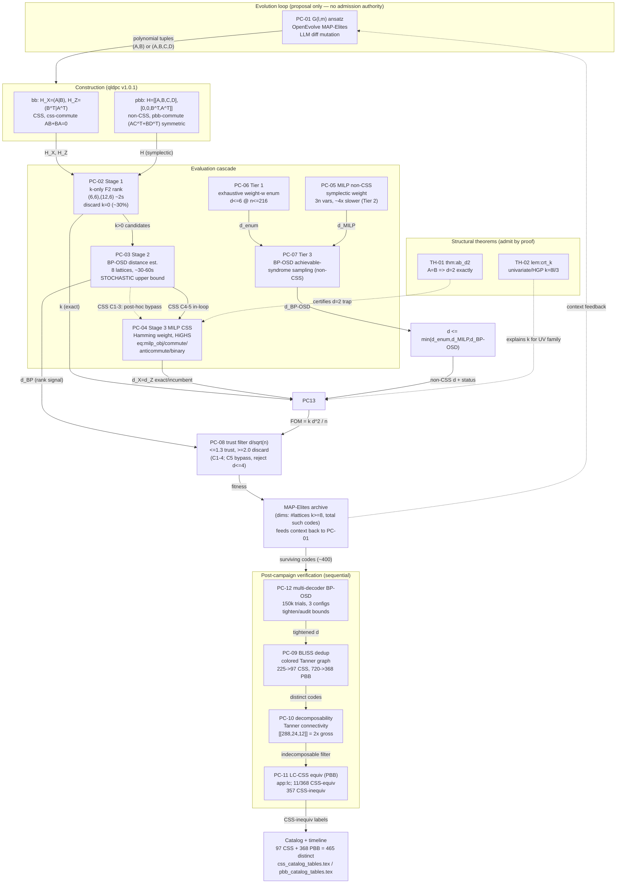

# logic.md — Dependency DAG for arXiv:2606.02418

Paper: "Evolutionary Discovery of Bivariate Bicycle Codes with LLM-Guided Search"
(Cruz-Benito, Cross, Kremer, Faro; IBM Research; PRX Quantum).
Source tex: `ref-paper/arxiv-2606.02418/src/paper.tex` (1091 lines),
`.../supplemental.tex` (715 lines).

This file is the overall **pipeline dependency DAG**: one node = one extractable code block /
pipeline stage. It is the data-flow companion to `ledger_seed.md` (typed entries) and `core.md`
(typed core IR). Node ids are SHARED with `ledger_seed.md` (`PC-01..PC-13`, `TH-01..TH-04`); this
file adds the explicit edge structure (inputs/outputs per node) that the ledger does not encode.

Conventions (per `_common/agentic_lean_contract.md` + `_common/markers.md`):
- Provenance: `P.l.NNN` = paper.tex line N; `S.l.NNN` = supplemental.tex line N. Tex labels
  (`thm:ab_d2`, `lem:crt_k`, `eq:milp_obj`, `eq:milp_commute`, `eq:milp_anticommute`, `eq:milp_binary`,
  `css-commute`, `pbb-commute`) preserved VERBATIM.
- The central invariant: **the LLM proposes; the scientific kernel admits.** `PC-01` (evolution) has
  NO admission authority; every candidate is admitted only by downstream gates `PC-02..PC-13`.
- Status vocabulary: `checked / conditional / approximate / empirical / conjectural / [AXIOM] / [HOLE] /
  [FUTURE] / [BLOCKING]`.
- Ground-truth algebra (shared `Sigma`/`Gamma`): `R = F2[x,y]/(x^l-1, y^m-1)`; `n = 2*l*m`;
  BB `H_X=(A|B)`, `H_Z=(B^T|A^T)`; PBB `H=[[A,B,C,D],[0,0,B^T,A^T]]`; `k = 2lm - 2*rank_F2(H_X)`;
  `FOM = k d^2 / n`.

[BLOCKING] All `module` fields cite the upstream repo `github.com/qiskit-community/qcode-discovery`
(`cruzbenito2026qcode`), which is EMPTY (README only) as of 2026-06-02 sha 4a9520e. Module paths
named in the tex (`evaluation/pbb_code.py`, `evaluation/clifford_equivalence.py`) are authoritative
labels but not yet importable. Unblocks when the repo is populated; owner = upstream authors.

---

## 1. DAG (mermaid — human view)



Notes on edge semantics:
- Dashed edge `PC-03 -.-> PC-04` = the **post-hoc bypass** for Campaigns 1-3 (BP-OSD ran in-loop;
  MILP applied only after the campaign). Solid `PC-03 -> PC-04` = the **in-loop** MILP path added for
  Campaigns 4-5 (Stage 3). Source: `fig:pipeline` caption P.l.234-239; sec:cascade P.l.251, P.l.257.
- Dashed `TH-01/TH-02 -.->` = theorems are not pipeline stages but **certify/explain** results a stage
  produces (TH-01 confirms the `d=2` trap MILP also finds in <1s; TH-02 explains the UV `k=8l/3`).
- Dashed `MAP-Elites -.-> PC-01` = the **archive-to-LLM context feedback** closing the evolution loop.
- `MIND` (= `d <= min(d_enum, d_MILP, d_BP-OSD)`) is the non-CSS distance combiner, not a separate
  ledger node; it is the adaptive-pipeline output of sec:noncss_pipeline (P.l.362).

---

## 2. Machine-readable node list (agent view)

YAML-style; one block per node. `inputs`/`outputs` name the data artifacts; `module` cites the
implementing code (per tex, pending repo population); `status` per contract vocabulary.

```yaml
# ---- Evolution (proposal) ----
- id: PC-01
  name: generator-ansatz evolution
  stage: evolve
  inputs: [highest-fitness ansatz, BB-algebra domain knowledge, MAP-Elites archive context, evaluation feedback]
  outputs: [code diff -> mutated ansatz G(l,m), polynomial tuples {(A_i,B_i)} or {(A_i,B_i,C_i,D_i)}]
  module: openevolve (MAP-Elites) + litellm proxy   # MISSING locally; repo empty
  modality: LiteratureGrounded
  status: empirical
  provenance: P.l.217-282 (sec:framework, sec:campaigns); tab:campaigns P.l.288-300
  admission_authority: false   # proposes only; kernel admits

# ---- Construction (qldpc) ----
- id: CONSTR-bb
  name: BB CSS construction
  stage: construct
  inputs: [trinomials A, B in R]
  outputs: [H_X=(A|B), H_Z=(B^T|A^T); n=2lm circulants lm x lm]
  invariant: css-commute   # H_X H_Z^T = AB+BA = 0 over F2 (R commutative)
  module: qldpc v1.0.1
  modality: LiteratureGrounded
  status: checked
  provenance: P.l.158-167 (sec:bb); css-commute P.l.166; ledger TH-03
- id: CONSTR-pbb
  name: PBB non-CSS construction
  stage: construct
  inputs: [4-tuple A, B, C, D in R]
  outputs: ["H=[[A,B,C,D],[0,0,B^T,A^T]]; block1 mixed X(A,B)+Z(C,D), block2 pure-Z"]
  invariant: pbb-commute   # rows commute iff (A C^T + B D^T) symmetric over F2
  reduces_to: CONSTR-bb when C=D=0
  module: evaluation/pbb_code.py   # named in S.l.690; repo empty
  modality: LiteratureGrounded
  status: checked            # commutation condition is exact; ~10% of random wt-3 4-tuples at (6,6) pass
  provenance: P.l.170-196 (sec:pbb); pbb-commute P.l.180, S.l.690; ledger TH-04

# ---- Cascade ----
- id: PC-02
  name: Stage 1 — k-only F2 rank screen
  stage: cascade
  inputs: [ansatz outputs on lattices (6,6),(12,6)]
  outputs: [k = 2lm - 2*rank_F2(H_X) (EXACT); discard if no k>0 at both (~30% mutants)]
  module: numpy F2 rank (substrate) + qldpc
  modality: ExactProof      # exact linear algebra over F2; zero stochasticity
  status: checked
  provenance: P.l.246-248 (sec:cascade); exactness P.l.706-707
  note: both screen lattices have 3|l -> possible divisibility-by-3 bias; may explain (16,9),(18,8) failure
- id: PC-03
  name: Stage 2 — BP-OSD distance estimate (in-loop, C1-3)
  stage: cascade
  inputs: [k>0 candidates on 8 lattices {(12,6),(6,12),(12,12),(24,6),(15,12),(30,6),(16,9),(18,8)}]
  outputs: [d_BP stochastic UPPER bound (d_true <= d_reported); ranking signal only]
  module: ldpc v2.2.0 (BP-OSD)   # MISSING locally
  modality: StatisticalInference
  status: approximate
  provenance: P.l.249-251; sec:bposd_limits P.l.306-317
  caveat: overestimates up to 12x for k/n>0.1 (PC-12); fitness reflects ~k-optimization not true FOM
- id: PC-04
  name: Stage 3 — MILP exact distance (CSS, Hamming weight)
  stage: cascade/verify
  inputs: [H_Z, Zbar_j (k logical generators); analogously H_X for d_X]
  outputs: [d = min(d_X, d_Z); exact iff MIP gap=0 for all 2k logicals, else incumbent upper bound]
  formulation: "min sum x_i [eq:milp_obj] s.t. H_Z x =0 mod2 [eq:milp_commute], <x,Zbar_j>=1 mod2 [eq:milp_anticommute], x_i in {0,1} [eq:milp_binary]; mod-2 linearized: sum a_i x_i - 2s = b"
  property: for BB d_X=d_Z (involution x->x^-1,y->y^-1 swaps H_X,H_Z)
  module: HiGHS via scipy.optimize.milp
  modality: ExactProof      # exact WHEN MIP gap=0; else ControlledApproximation (valid bound)
  status: checked           # conditional (incumbent) when gap>0
  provenance: P.l.319-336 (sec:milp); S.l.659-674 (CSS formulation)
  schedule: in-loop top-candidates C4-5; post-hoc C1-3 (dashed bypass)
- id: PC-05
  name: MILP exact distance (non-CSS PBB, symplectic weight) — Tier 2
  stage: verify
  inputs: [symplectic-flipped H, Lbar_j (2k logical reps from qldpc symplectic Gaussian elim)]
  outputs: [d_MILP (symplectic); partial = valid upper bound]
  formulation: "min sum w_i s.t. H (a|b)^T =0 mod2, <(a|b),Lbar_j>_symp=1 mod2, w_i=a_i OR b_i (w_i>=a_i, w_i>=b_i, w_i<=a_i+b_i), a_i,b_i,w_i in {0,1}; H rows stored (s_Z|s_X) row-flip; 3n binary vars (~4x slower)"
  module: HiGHS via scipy.optimize.milp
  modality: ExactProof      # exact WHEN gap=0
  status: checked           # conditional when gap>0
  provenance: S.l.676-691 (non-CSS symplectic formulation); timeouts P.l.350
- id: PC-06
  name: Tier 1 — exhaustive weight-w enumeration (non-CSS)
  stage: verify
  inputs: [stabilizer matrix H; weight bound w]
  outputs: [d=w exactly if a weight-w nontrivial logical found]
  regime: d<=6 at n<=216; d<=4 at n>216 (~89GB memory at n=360)
  module: syndrome lookup-table (column dicts + XOR lookups)   # repo empty
  modality: ExactProof
  status: checked
  provenance: P.l.344-347 (Tier 1)
- id: PC-07
  name: Tier 3 — BP-OSD with achievable-syndrome sampling (non-CSS)
  stage: verify
  inputs: [H_eff = (H_check; L), per-channel achievable subspace (GF(2) null-space projection)]
  outputs: [d_BP-OSD upper bound; restored ~0% -> ~100% decode success on tested PBB]
  fix: sample only from achievable subspace per channel (naive random sampling -> 0% on many PBB)
  module: ldpc v2.2.0 + GF(2) projection   # MISSING locally
  modality: StatisticalInference
  status: approximate
  provenance: P.l.353-360 (Tier 3); achievable subspace P.l.357-359
- id: MIND
  name: non-CSS distance combiner
  stage: verify
  inputs: [d_enum (PC-06), d_MILP (PC-05), d_BP-OSD (PC-07)]
  outputs: ["d <= min(d_enum, d_MILP, d_BP-OSD); label exact (all 2k optimal) or trusted (>=2 methods)"]
  module: adaptive pipeline (sec:noncss_pipeline)   # repo empty
  modality: ControlledApproximation   # min of independent bounds; exact only if some method certifies
  status: conditional
  provenance: P.l.362-364
  note: deep MILP of 149 PBB entries -> 63 exact, 33 downward corrections (22%), largest d=24->16 @ n=360

# ---- Theorems (admit by proof) ----
- id: TH-01
  name: thm:ab_d2 (A=B distance trap)
  stage: theorem
  inputs: [BB or PBB code with A=B, k>0]
  outputs: [d=2 exactly (regardless of check weight)]
  proof_sketch: "H_X rows (A_r|A_r) in diagonal S; v_i=(e_i,e_i) in ker(H_Z); X-stab iff e_i in rowspace(A); k>0 => rank(A)<lm => some e_i outside => wt-2 X-logical => d<=2; col wt>=2 => d>=2; hence d=2. PBB extension via wt-2 Z-op (0|e_i+e_{i+lm}) in normalizer."
  module: proof (App D)   # certifies the d=2 result PC-04/PC-05 find in <1s; BP-OSD misses even @1.5e6 trials
  modality: ExactProof
  status: checked
  provenance: P.l.205-211 (sec:ab_trap), P.l.956-980 (app:ab_trap, Theorem 1)
- id: TH-02
  name: lem:crt_k (univariate / HGP encoding dimension)
  stage: theorem
  inputs: ["A(y)=1+y+y^2, B(x)=A(x^c), c=l/3, 3|l, 3|m"]
  outputs: [k = 8l/3 (BB(A,B) ~ HGP(H_B, H_A^T))]
  proof_sketch: "HGP dim k=k1 k2 + k1^T k2^T [tillich2014quantum]; dim ker H = deg gcd(f, z^N-1) [macwilliams]; k_A=k_A^T=2, k_B=k_B^T=2l/3; k = 2*(2l/3)*2 = 8l/3. Verified for 1680 combos lm<=250."
  module: proof (App C)   # explains UV-family k; UV codes universally d in {2,4} (Tillich-Zemor)
  modality: ExactProof    # depends on [AXIOM] tillich2014quantum, macwilliams1977theory
  status: conditional
  provenance: P.l.419-421 (sec:families), P.l.982-1024 (app:crt, Theorem 2)

# ---- Ranking / fitness / archive ----
- id: PC-13
  name: figure-of-merit ranking (FOM = k d^2 / n)
  stage: rank
  inputs: [k (PC-02, exact), d (PC-03 est / PC-04 / PC-05 / MIND)]
  outputs: [FOM = k d^2 / n per code; gross code [[144,12,12]] => FOM=12]
  module: scoring (BPT-motivated kd^2=O(n))   # repo empty
  modality: DimensionalConsistency
  status: checked
  provenance: P.l.198-203 (sec:fom)
- id: PC-08
  name: trust filter d/sqrt(n)
  stage: fitness-gate
  inputs: [d_BP/sqrt(n) (C1-4) or verified d (C5)]
  outputs: [fitness weight: <=1.3 fully trusted, >=2.0 discarded, linear interp between; C5 reject d<=4]
  module: trust filter (sec:trust)   # repo empty
  modality: StatisticalInference   # operates on unreliable BP-OSD estimates in C1-4
  status: approximate
  provenance: P.l.366-371 (sec:trust)
  failure: [[360,40,2]] passed @ d_BP/sqrt(n)=1.26 despite true 0.11; C5 bypasses entirely
- id: MAP-ELITES
  name: MAP-Elites archive
  stage: archive
  inputs: [fitness-scored ansatze (PC-08)]
  outputs: [archive indexed on 2 behavioral dims; context feedback -> PC-01]
  dims_default: [# lattices yielding k>=8 codes, total count of such codes]
  dims_campaign4: [polynomial term-count, monomial structure (mixed/diagonal-mixed/separated)]
  module: openevolve   # MISSING locally
  modality: LiteratureGrounded
  status: empirical
  provenance: P.l.226-228 (sec:framework); C4 dims P.l.228, P.l.272

# ---- Post-campaign verification (sequential) ----
- id: PC-12
  name: multi-decoder BP-OSD verification protocol (post-hoc, 150k trials)
  stage: post/verify
  inputs: [surviving codes]
  outputs: [tightened BP-OSD bounds; global min across 30 batches (3 configs x 10 batches x 5000)]
  configs: [OSD_0/sum-product, OSD-CS_10/sum-product, OSD-CS_10/minimum-sum]
  module: ldpc v2.2.0   # MISSING locally
  modality: StatisticalInference
  status: approximate
  provenance: P.l.306-317 (sec:bposd_limits); S.l.81-210 (decoder stats, per-batch, 1.5M-trial)
  finding: 147/154 C1-3 reps tightened (mean ~8.4 pts); even 1.5M trials overestimate ~3x
- id: PC-09
  name: BLISS dedup (colored Tanner-graph canonical labeling)
  stage: post/dedup
  inputs: [verified code representations (225 CSS reps; 720 tuple-distinct PBB)]
  outputs: [permutation-equivalence classes: 225->97 distinct CSS (99 classes), 720->368 PBB]
  coloring_css: [qubits c0, X-checks c1, Z-checks c2]
  coloring_pbb: [qubits + per-stabilizer X-support vertex + Z-support vertex (3 colors) + tying edge]
  module: python-igraph + BLISS   # MISSING locally
  modality: LiteratureGrounded   # sound+complete for permutation equivalence under the coloring
  status: checked
  provenance: P.l.380-399 (sec:families); P.l.386 (368 PBB)
  note: "distinct" count is a conservative UPPER bound vs broader (LC/full-Clifford) equivalence
- id: PC-10
  name: Tanner-graph decomposability (direct-sum detection)
  stage: post/structure
  inputs: [combined Tanner graph (H_X + H_Z) connectivity]
  outputs: [disconnected => direct sum; e.g. [[288,24,12]] = [[144,12,12]] (+) [[144,12,12]]]
  module: Tanner connectivity analysis   # repo empty
  modality: ExactProof   # disconnection => restriction is itself a logical => decomposes
  status: checked
  provenance: P.l.426-434 (sec:families)
  note: invisible to BP-OSD; the [[288,24,12]] decomposes on even/odd x-indices (only even x-exponents)
- id: PC-11
  name: LC-CSS equivalence test for PBB (App E)
  stage: post/structure
  inputs: [368 PBB stabilizer generators; 6 Clifford coset reps {I,S,H,HS,SH,HSH}]
  outputs: [11/368 CSS-equiv (10 non-uniform Hadamard, 1 uniform-S [[36,4,6]]); 357 CSS-inequiv within tested LC families]
  tests: [group-CSS rank condition (Lemma 7.4 cross2025small), Hadamard 2-coloring parity union-find, affine GF(2) for {I,S}/{H,HS}, 36 uniform per-block]
  gaps: [non-uniform {SH,HSH} on block1; cross-class non-uniform patterns]
  module: evaluation/clifford_equivalence.py   # named S.l.1087; repo empty
  modality: ExactProof   # exact within tested families; residual coverage gaps (a)-(b) unproven
  status: conditional
  provenance: P.l.184-194 (sec:pbb); P.l.1026-1087 (app:lc)

# ---- Output ----
- id: CATALOG
  name: catalog + timeline
  stage: output
  inputs: [distinct codes (PC-09), structural labels (PC-10, PC-11), distances + FOM (PC-04/05/13)]
  outputs: [97 CSS + 368 PBB = 465 distinct codes at n<=360]
  module: css_catalog_tables.tex, pbb_catalog_tables.tex   # data at qcode-discovery (empty repo)
  modality: LiteratureGrounded
  status: empirical
  provenance: P.l.52-53 (abstract count); S.l.46-78 (sm:css_catalog, sm:pbb_catalog)
```

---

## 3. Topological order (linear pipeline summary)

```
PC-01  (evolve ansatz; LLM proposes)
  -> CONSTR-bb | CONSTR-pbb  (construct H from polynomial tuples; css-commute / pbb-commute)
  -> PC-02     (Stage 1: k via F2 rank — EXACT; ~30% discard)
  -> PC-03     (Stage 2: BP-OSD distance — stochastic ranking signal)
  -> PC-04 / PC-05+PC-06+PC-07->MIND  (Stage 3 MILP CSS | non-CSS adaptive 3-tier)
       [TH-01 certifies A=B d=2; TH-02 explains UV k=8l/3]
  -> PC-13     (FOM = k d^2 / n)
  -> PC-08     (trust filter d/sqrt(n))
  -> MAP-ELITES (archive; behavioral dims) --context--> PC-01   (loop closes)
  ===== post-campaign (on ~400 survivors) =====
  -> PC-12     (multi-decoder BP-OSD bound tightening)
  -> PC-09     (BLISS dedup: 225->97 CSS, 720->368 PBB)
  -> PC-10     (decomposability: exclude [[288,24,12]] direct sum)
  -> PC-11     (LC-CSS equiv for PBB: 11 collapse, 357 CSS-inequiv)
  -> CATALOG   (465 distinct = 97 CSS + 368 PBB)
```

Schedule variance across campaigns (sec:cascade, sec:campaigns):
- **Campaigns 1-3 (CSS):** `PC-03` in-loop; `PC-04` MILP post-hoc (dashed bypass). `PC-08` active.
- **Campaign 4 (CSS, wt-8 mixed-monomial):** `PC-04` MILP in-loop (Stage 3 added). `PC-08` active.
- **Campaign 5 (PBB):** `PC-05/PC-06/PC-07` adaptive pipeline in-loop; `PC-08` bypassed (reject `d<=4`).

---

## 4. Open obligations on the DAG (markers)

- [BLOCKING] `module` artifacts unimportable — repo `qcode-discovery` empty (sha 4a9520e, 2026-06-02).
  Blocks reproduction of every code-level node (`PC-*` modules, `CONSTR-*`, `CATALOG`). Unblocks on
  repo population; owner = upstream authors. (Mirrors `sig.code` [BLOCKING] in `core.md`.)
- [AXIOM] `PC-04`/`PC-05` exactness rests on HiGHS branch-and-bound correctness (`scipy.optimize.milp`,
  local 1.17.1) — trusted, not re-proven here. `TH-02` rests on `tillich2014quantum` +
  `macwilliams1977theory` (cited, not reproduced).
- [AXIOM] `PC-03`/`PC-07`/`PC-12` rest on `ldpc` v2.2.0 (MISSING locally); BP-OSD overestimation
  (up to 12x) is the measured property motivating the MILP gates, not a flaw to fix.
- [FUTURE] `PC-11` residual coverage gaps (a) non-uniform {SH,HSH} on block 1, (b) cross-class
  non-uniform patterns — the 357 are "CSS-inequiv within tested LC families", NOT "genuinely non-CSS".
  Full `6^n` Clifford enumeration is computationally infeasible at n>=36.
- [FUTURE] Campaign 5 excluded the high-m lattices (12,12),(15,12) where the highest-FOM CSS codes
  live; PBB-vs-CSS-envelope question (`PC-13` -> `CATALOG`) remains open there.
